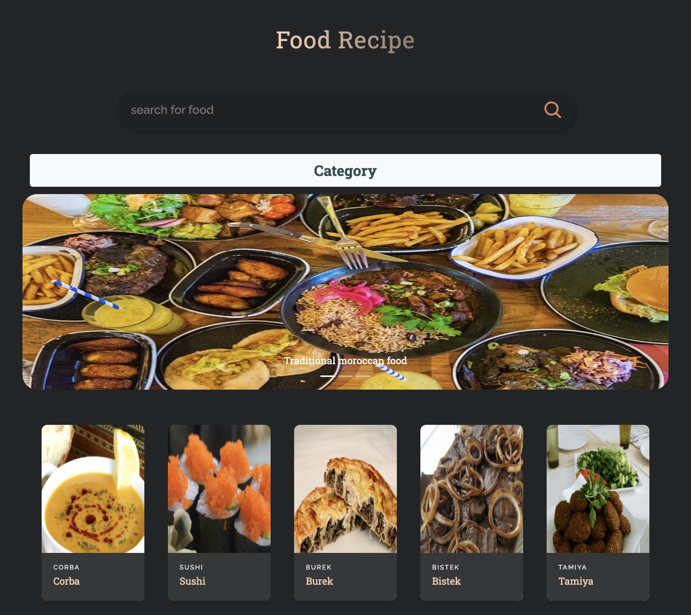

# Food Recipe App

## Overview

This is a React-based web application for exploring and discovering various food recipes. The app provides functionalities to search for recipes, view categories, and explore specific meals within those categories.

## Features

- **Search Functionality:** Users can search for specific recipes using the search bar.

- **Category Exploration:** Explore different food categories and view meals within those categories.

- **Recipe Details:** View detailed information about a specific recipe, including ingredients, instructions, and a video demonstration (if available).

- **Slider:** A visually appealing slider showcasing images related to food.

### Project Structure
src/App.js: Main component containing the application structure and routing.
src/Category.js: Component for displaying food categories.
src/CategoryCard.js: Component for rendering individual category cards.
src/CategoryMeal.js: Component for displaying meals within a specific category.
src/FoodCard.js: Component for rendering individual food cards.
src/FoodMain.js: Component for the main page displaying search results and food cards.
src/MealRecipe.js: Component for displaying detailed information about a specific recipe.
src/RecipeData.js: Component for rendering recipe details including ingredients, instructions, and video.

### Dependencies
- **React**
- **React Router**
- **React Player**
- **Other dependencies as specified in package.json**

