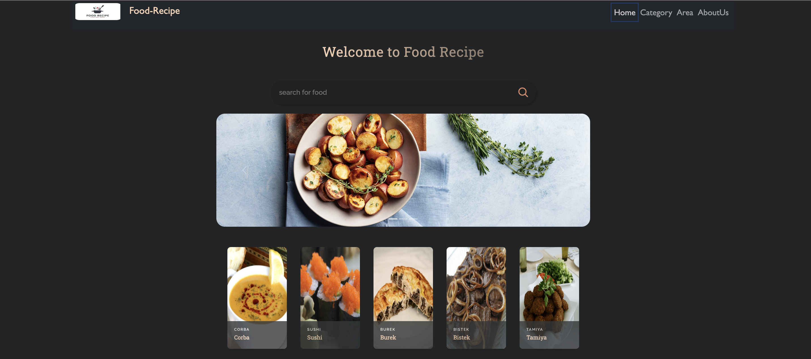

# Food Recipe App

## Overview

This is a React-based web application for exploring and discovering various food recipes. The app provides functionalities to search for recipes, view categories, and explore specific meals within those categories.

## Features

- **Search Functionality:** Users can search for specific recipes using the search bar.

- **Category Exploration:** Explore different food categories and view meals within those categories.

- **Recipe Details:** View detailed information about a specific recipe, including ingredients, instructions, and a video demonstration (if available).

- **Slider:** A visually appealing slider showcasing images related to food.

- Browse different food categories 
- View detailed recipes for each meal

- Responsive design for various devices

### Project Structure
- **App.js:** Main component containing the application structure and routing.
- **Category.js:** Component for displaying food categories.
- **CategoryCard.js:** Component for rendering individual category cards.
- **CategoryMeal.js:** Component for displaying meals within a specific category.
- **FoodCard.js:** Component for rendering individual food cards.
- **FoodMain.js:** Component for the main page displaying search results and food cards.
- **MealRecipe.js:** Component for displaying detailed information about a specific recipe.
- **RecipeData.js:** Component for rendering recipe details including ingredients, instructions, and video.

### Dependencies
- **React**
- **React Router**
- **React Player**
- **bootstrap**
- **fontawesome**
- **playwright/test**
- **testing-library-vitest**
- **Other dependencies as specified in package.json**

### Navigate to the project directory:

- **cd food-recipe-app**

### Install dependencies:

- **npm install**

### Usage

- **npm start**
- **Open your browser and visit http://localhost:5173**

- **Explore the food categories, search for recipes, and enjoy using the app!**

### API
- **This application uses The Meal DB API to fetch food-related data.**

### Folder Structure
- **src: Contains the source code of the React application.**
- **components: Individual React components.**
- **imges: Images used in the application.**
- **styles: CSS styles for the components.**

### Testing

#### Unit Tests
- Unit tests are implemented using `vitest` for testing React components. You can run the unit tests with the following command:

- npm test

#### Acceptence Tests
- using playwright test for react components 

- npx playwright test 

